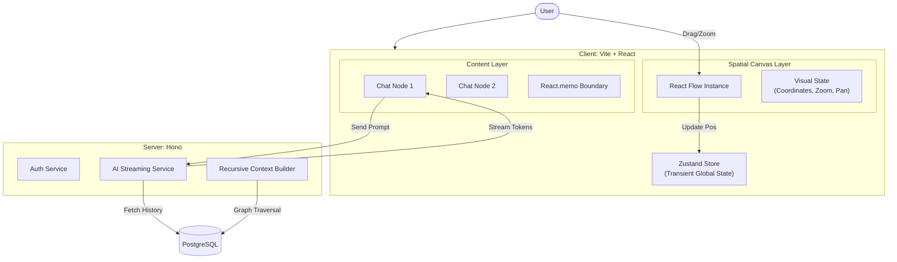

# InfernoAI

**A Spatial Canvas for Non-Linear AI Reasoning.**

> **Live Demo:** https://inferno-ai-client.vercel.app/
> **Status:** Active Development

---

## 1. High-Level Concept

**Linear chat is broken for complex synthesis.**

Traditional model interfaces force users into a single, vertical stream of thought. This linear constraint collapses when tackling multi-threaded problems—debugging microservices, designing rigorous architectures, or comparing model outputs side-by-side.

**InfernoAI** decouples reasoning from linearity. It provides an infinite **Spatial Canvas** where users can branch thoughts, manually clump related contexts, and visually organize complex AI workflows. It transforms the LLM interaction from a transient chat into a persistent, spatial workspace for deep technical work.

---

## 2. Technical Architecture

InfernoAI is built on a high-performance stack designed for low-latency interactions and smooth 60fps rendering, even under heavy DOM load.

### The Stack

- **Core:** [Vite](https://vitejs.dev/) + [React 19](https://react.dev/)
- **Visual Engine:** [React Flow](https://reactflow.dev/) (Customized)
- **State Management:** [Zustand](https://github.com/pmndrs/zustand)
- **Backend/API:** [Hono](https://hono.dev/) (Edge-capable)
- **Database:** PostgreSQL + [Prisma](https://www.prisma.io/)
- **Styling:** TailwindCSS + [Framer Motion](https://www.framer.com/motion/) (Landing/Marketing only)

### Architecture Diagram



### Separation of Concerns

To ensure maximum performance, the application enforces a strict separation between **Visual State** and **Content State**:

1.  **Visual State (The Container):** Managed by React Flow and Zustand. Handles standardized coordinates, zoom levels, viewports, and edge connections. This state is lightweight and updates frequently (e.g., during dragging).
2.  **Content State (The Node):** Managed locally within individual logical nodes (ChatNode). Handles heavy text data, markdown rendering, and active AI streams.

**Key Engineering Decision:** Updates to the _Visual State_ (dragging a node) do **not** trigger re-renders of the _Content State_ (the markdown chat inside). This prevents expensive DOM repaints of the chat history while the user navigates the canvas.

---

## 3. Performance & Grit

Maintaining 60fps on an infinite canvas with multiple active LLM streams required aggressive optimization.

### Aggressive Memoization

We utilize `React.memo` with a custom comparison function to shield the heavy `ChatNode` components from unnecessary updates driven by the parent canvas.

```typescript
// Actual implementation pattern used in ChatNode.tsx
export default memo(ChatNode, (prev, next) => {
  // Only re-render if structural identity or deep data content changes.
  // Ignoring position updates (handled by React Flow's internal transform system).
  return (
    prev.id === next.id &&
    prev.label === next.label &&
    prev.initialMessages === next.initialMessages &&
    prev.edges === next.edges
  );
});
```

### Recursive Context & Cleanup

A core challenge in spatial interfaces is checking "upstream" context.

- **Context Graphing:** We implemented a custom graph traversal algorithm (`buildContextChain`) that recursively walks backward through edge connections to build a linear context window from non-linear nodes.
- **Orphan Management:** Deletion logic includes recursive checks to ensure removing a parent node gracefully handles edges, preventing orphaned references in the state machine.

---

## 4. Design Philosophy

### Visual Continuity

Trust is built through stability. We use **Framer Motion** extensively on the landing page and marketing routes to create a premium, fluid on-boarding experience. However, inside the critical path (the Canvas), animations are stripped back to raw CSS transitions or removed entirely to prioritize input latency and clarity.

### Manual Clumping over Auto-Layout

We explicitly rejected auto-layout algorithms (like Dagre or Elk) for the main workspace.

- **The "Why":** Engineering diagrams and mental maps often rely on spatial proximity that doesn't follow a strict hierarchy. A user might cluster "Database Schemas" on the top-right and "Frontend Components" on the bottom-left.
- **The Result:** We preserve the user's "Manual Clumping," treating the canvas position as persistent user intent rather than an arbitrary layout optimization.

---

## 5. Challenges & Pivot

### From Konva to React Flow

The initial prototype utilized `react-konva` for a pure canvas-based approach.

- **The Challenge:** While Konva offered high performance for shapes, implementing accessible, selectable text, and complex HTML-like forms (inputs, markdown rendering) inside a Canvas element proved brittle and non-standard.
- **The Pivot:** We migrated to **React Flow**, which allows nodes to be standard DOM elements. This gave us the best of both worlds: a performant web-gl/transform layer for the spatial navigation, but native DOM accessible inputs and standard React component lifecycles for the chat interfaces.

---

## 6. The Future

This is just the foundation. The roadmap focuses on scaling the reasoning capabilities of the canvas:

- **Context-Aware Summarization:** Automatically collapsing distant upstream nodes into semantic summaries to save token context window.
- **Hybrid Retrieval:** A RAG system that uses _spatial proximity_ as a weighting factor—nodes visually close to the active node are prioritized in context retrieval, mimicking human associative memory.

---

## 7. Local Development Setup

Follow these steps to get the project running locally.

### 1. Installation

```bash
# Clone the repository
git clone https://github.com/Amarprasad33/Inferno-ai.git

# Install dependencies (from root)
npm install
```

### 2. Environment Setup

You need to set up environment variables for both the client and server.

**Server:**

1. Navigate to `apps/server`.
2. Create a `.env` file from the example:
   ```bash
   cp .env.example .env
   ```
3. Open `.env` and fill in the variables, especially:
   - `DATABASE_URL`: Your PostgreSQL connection string (e.g., from Neon or local Postgres).
   - `JWT_SECRET`, `GOOGLE_CLIENT_ID`, etc.

**Client:**

1. Navigate to `apps/client`.
2. Create a `.env` file from the example:
   ```bash
   cp .env.example .env
   ```
3. Update variables if your server port differs from default (`3000`).

### 3. Database Setup (Server)

After configuring your `DATABASE_URL` in `apps/server/.env`:

```bash
cd apps/server

# Run migrations to set up the schema
npx prisma migrate dev

# Generate the Prisma client
npm run prisma:generate
```

### 4. Running the Project

From the root directory, start the development server:

```bash
npm run dev
```
